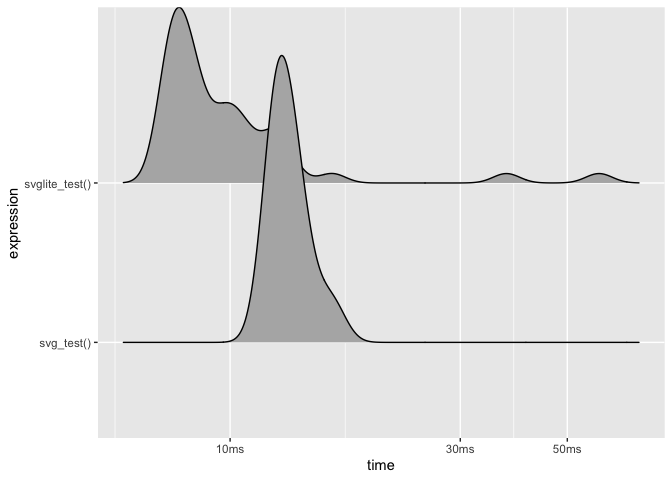

<!-- README.md is generated from README.Rmd. Please edit that file -->

# svglite <a href='https://svglite.r-lib.org'></a>

<!-- badges: start -->

[](https://github.com/r-lib/svglite/actions)
[](https://codecov.io/gh/r-lib/svglite?branch=master)
[](https://cran.r-project.org/package=svglite)
<!-- badges: end -->

svglite is a graphics device that produces clean svg output, suitable
for use on the web, or hand editing. Compared to the built-in `svg()`,
svglite produces smaller files, and leaves text as is, making it easier
to edit the result after creation. It also support multiple nice
features such as embedding of web fonts.

## Installation

svglite is available on CRAN using `install.packages("svglite")`. You
can install the development version from github with:

``` r
# install.packages("devtools")
devtools::install_github("r-lib/svglite")
```

## Benchmarks

While the performance of `svglite()` and `svg()` is comparable (with an
upper hand to svglite)…

``` r
library(svglite)

x <- runif(1e3)
y <- runif(1e3)
tmp1 <- tempfile()
tmp2 <- tempfile()

svglite_test <- function() {
  svglite(tmp1)
  plot(x, y)
  dev.off()
}
svg_test <- function() {
  svg(tmp2, onefile = TRUE)
  plot(x, y)
  dev.off()
}

plot(bench::mark(svglite_test(), svg_test()), type = 'ridge')
```



…it produces considerably smaller files:

``` r
file.size(c(tmp1, tmp2)) / 1024
#> [1]  74.88281 320.84668
```

In both cases, compressing to make `.svgz` is worthwhile. svglite
supports compressed output directly and just need a `.svgz` extension in
the filename to trigger it:

``` r
gz <- function(in_path, out_path = tempfile()) {
  out <- gzfile(out_path, "w")
  writeLines(readLines(in_path), out)
  close(out)
  
  invisible(out_path)
}
tmp3 <- tempfile(fileext = ".svgz")
svglite(tmp3)
plot(x, y)
invisible(dev.off())

file.size(c(tmp3, gz(tmp2))) / 1024
#> [1]  9.427734 38.589844
```
